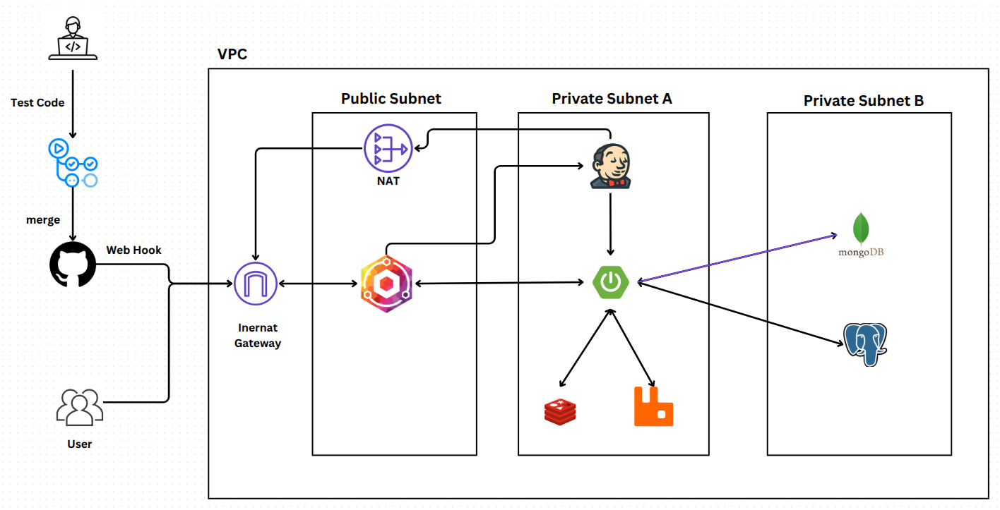

# Catsnap

기존 스냅사진 예약은 작가에 대한 리뷰만을 볼 수 있었습니다. 그러나 스냅사진은 사진작가뿐만 아니라 촬영 장소도 중요한 요소입니다. 이에 Catsnap 서비스는 사진작가뿐만 아니라
촬영 장소에 대한 리뷰도 함께 확인할 수 있는 서비스를 제공하고자 개발을 했습니다.

# 코드 커버리지

### 전체 커버리지

### 모듈별 커버리지

| 모듈            | 커버리지                                                                                                                                                                                    | 상세             |
|---------------|-----------------------------------------------------------------------------------------------------------------------------------------------------------------------------------------|----------------|
| Gateway       |           | API Gateway 서버 |
| Authorization |  | 사용자 인증 서버      |
| Mono          |                    | 메인 비즈니스 로직     |

# 기술 스택

# 개발 기간 및 인원

- 24.09 ~ 개발 및 배포 중
- 백엔드 1명, 프론트엔드 1명

# 아키텍처

# 기능(계속 개발 중)

### 모델(사용자) 가능

<table>
  <tr>
    <td align="center"><strong>회원가입 및 로그인</strong></td>
    <td align="center"><strong>메인 페이지</strong></td>
    <td align="center"><strong>내 예약 현황</strong></td>
  </tr>
  <tr>
    <td></td>
    <td></td>
    <td></td>
  </tr>
</table>
<table>
  <tr>
    <td align="center"><strong>작가 정보</strong></td>
    <td align="center"><strong>예약 잡기</strong></td>
    <td align="center"><strong>리뷰 작성</strong></td>
  </tr>
  <tr>
    <td></td>
    <td></td>
    <td></td>
  </tr>
</table>

### 작가 기능

<table>
  <tr>
    <td align="center"><strong>예약 환경 설정</strong></td>
    <td align="center"><strong>예약 시간 형식</strong></td>
    <td align="center"><strong>예약 시간 형식 요일에 매핑</strong></td>
  </tr>
  <tr>
    <td></td>
    <td></td>
    <td></td>
  </tr>
</table>

# 기능 구현 및 버그 수정 기록

- [커스텀으로 등록한 스프링 시큐리티 필터가 중복 적용되는 버그 수정](https://github.com/CUKCatSnap/CUKCATSNAP_Server/pull/19)
- [존재하지 않는 API호출 시, 예외 처리](https://github.com/CUKCatSnap/CUKCATSNAP_Server/pull/74)
- [로그에서 requestBody가 null로 표시되는 버그 수정](https://github.com/CUKCatSnap/CUKCATSNAP_Server/pull/86)
    - [캐시 필터 위치 조정](https://github.com/CUKCatSnap/CUKCATSNAP_Server/pull/93)
- [동시에 같은 예약을 할 때, 두 예약 모두가 성공하는 버그 수정](https://github.com/CUKCatSnap/CUKCATSNAP_Server/pull/88)
- [작가와 모델의 엔티티 구조 변경](https://github.com/CUKCatSnap/CUKCATSNAP_Server/pull/108)
- [스프링 시큐리티 필터 체인 단일화](https://github.com/CUKCatSnap/CUKCATSNAP_Server/pull/113)

### 스웨거

- [바로가기](https://api.catsnap.net/swagger-ui/index.html)

